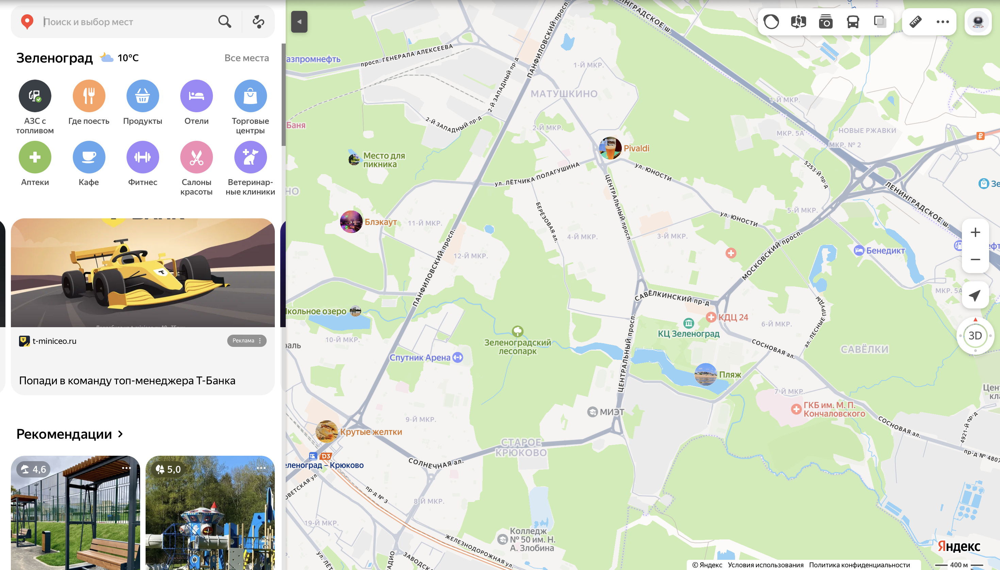
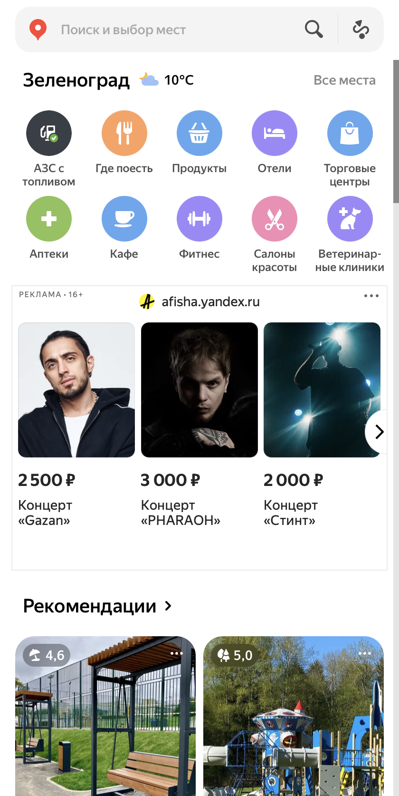
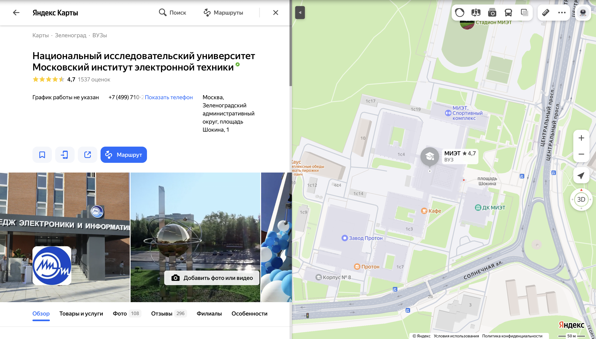
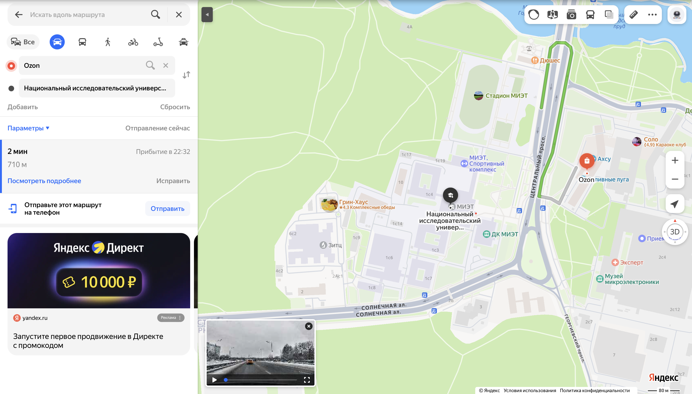
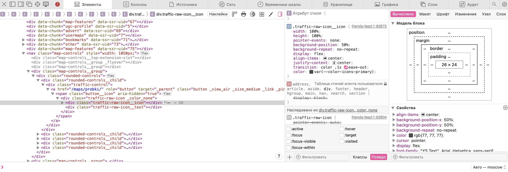
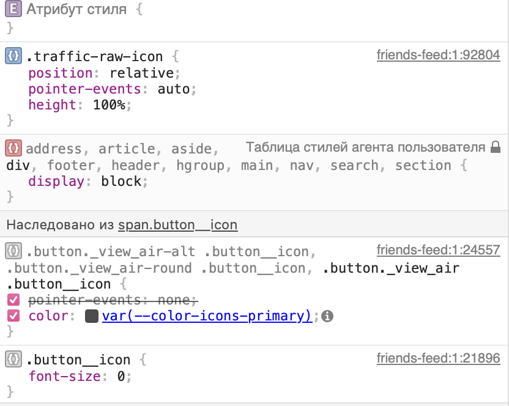
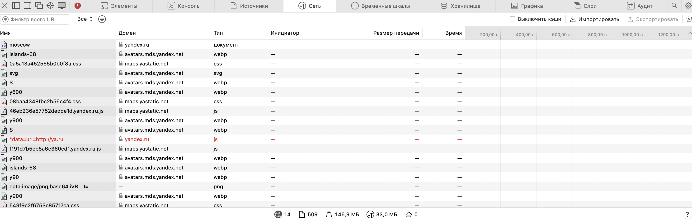
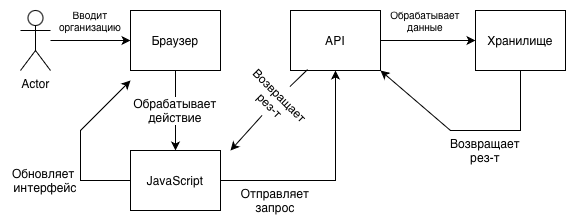
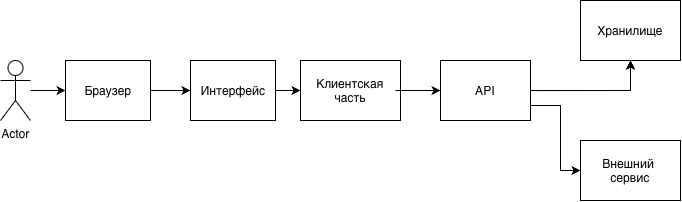

# computer-science-lab1
Лабораторная работа №1
# Анализ информационной системы
## 1. Описание системы

Название: Яндекс Карты

Ссылка: https://yandex.ru/maps/

Назначение: Яндекс Карты -  это бесплатный поисково-информационный картографический сервис компании Яндекс, предназначенный для поиска мест, организаций и построения маршрутов.

Целевая аудитория:
- Водители автомобилей и пассажиры
- Туристы и гости города
- B2B - сегмент

Основные возможности:
- построение маршрутов 
- поиск мест и организаций
- дорожные происшествия 
- отслеживание общественного транспорта

Выбранный сценарий:
поиск организации и построение маршрута.

## 2. Анализ пользовательского интерфейса
### 2.1 Основные страницы и разделы:
В рамках лабораторной работы исследуется информационная система Яндекс Карты — картографический сервис.

В системе используются следующие основные страницы и разделы:
- Главная страница Яндекс Карты
- Раздел аккаунта пользователя 
- Поиск и выбор мест
- Каталог мест
- Рекомендации 
- Карта

Авторизация происходит автоматически, если у вас есть аккаунт Яндекс ID
### 2.2 Ключевые элементы интерфейса
- Главная страница Яндекс Карты - отображение всех последующих элементов
- Раздел аккаунта пользователя - управление подпиской и историей запросов
- Поиск и выбор мест - способ задания запроса
- Каталог мест - раздел с местами 
- Рекомендации - знаменитые достопримечательности города
- Карта - просмотр мест и построение маршрута

### 2.3 Выполнение пользовательского сценария
Выбранный сценарий: поиск организации и построение маршрута.

Для выполнения сценария использовалось главное здание НИУ "МИЭТ" в АО Зеленограде.

Последовательность действий:
1. Открыть страницу Яндекс Карты
2. Нажать на строку Поиск и выбор мест
3. Написать НИУ "МИЭТ" или любую альтернативу
4. Выбрать нужную строку
5. В окне отображения места нажать на кнопку маршрут
6. Написать изначальное положение или выбрать на карте
7. При необходимости выбрать самый удобный вариант

В результате выполнения сценария был выполнен поиск организации и построен маршрут.

### 2.4. Компоненты, участвующие в сценарии

- Главная страница Яндекс Карты - позволяет пользователю выбрать нужную функцию - 1 этап сценария
- Поиск и выбор мест - способ найти подходящее место или организацию - 2-5 этапы сценария
- Карта - позволяет построить маршрут - 6-7 этапы сценария 

### 2.5. Скриншоты сценария

Скриншот 1. Главная страница сайта
На скриншоте показана главная страница Яндекс Карты 

Скриншот 2. Поиск и выбор мест
На скриншоте показана шапка каталогов карт

Скриншот 3. Карта выбранного места
На скриншоте показано местоположение выбранной организации

Скриншот 4. Маршрут
На скриншоте показана шапка возможностей для выбранной организации

### 2.6 Вывод
В ходе анализа пользовательского интерфейса Яндекс Карты были определены основные страницы системы, ключевые элементы управления и компоненты картографического сервиса.

Выбранный сценарий состоит из следующих основных этапов:

переход на главную страницу сайт;
выбор места через поиск;
возможность изучения информации об организации;
построение маршрута из любой заданной точки;
выбор наиболее удобного маршрута.
Пользовательский интерфейс Яндекс Карты построен на основе виртуальной карты, с помощью которой можно легко выполнить пункты. Для выполнения сценария пользователю не требуется самостоятельно писать HTML-код.

## 3. Анализ клиентской части
### 3.1 Исследование HTML-структуры

Для анализа был выбран элемент интерфейса «Поиск» в шапке каталога Яндекс Карты.

Элемент используется для выбора места. 

Основные характеристики элемента:
- HTML-тег: 
<button role="button" type="submit" class="button _view_search _size_medium" aria-label="Найти">
<svg xmlns="http://www.w3.org/2000/svg" width="24" height="24" fill="none" viewBox="0 0 24 24"><path fill="currentColor" fill-rule="evenodd" d="M9.5 2a7.5 7.5 0 1 0 4.14 13.755l3.946 4.66a2 2 0 1 0 2.828-2.83l-4.659-3.945A7.5 7.5 0 0 0 9.5 2M4 9.5a5.5 5.5 0 1 1 11 0 5.5 5.5 0 0 1-11 0" clip-rule="evenodd"></path></svg>
</button>

- СSS-классы: small-search-form-view__button, отвечающих за оформление элемента.
- Текст элемента: " "
- Вложенные элементы: иконка в формате svg

Скриншот HTML-структуры:

### 3.2. Исследование CSS

Для выбранного элемента были обнаружены CSS-классы, определяющие его внешний вид и положение на странице.

Основные свойства:

display	- Определяет способ отображения элемента
padding	- Задает внутренние отступы
font-size - Определяет размер текста
color -	Определяет цвет текста
background - Определяет фон элемента
cursor - Определяет вид курсора при наведении на элемент

### 3.3 Исследование JavaScript

JavaScript используется для реализации интерактивного поведения редактора.

В разделе Sources были обнаружены JavaScript-файлы, загружаемые вместе со страницей.

JavaScript отвечает, в частности, за:

- Интерактивные карты
- Поиск координат
- Подсказки на поисковой строке

При нажатии на кнопку добавления блока интерфейс реагирует на действие пользователя и открывает библиотеку блоков.

Скриншот загруженных JavaScript - файлов:

### 3.4 Загружаемые ресурсы 
При открытии карт браузер загружает различные ресурсы, необходимые для работы приложения.

Были обнаружены следующие типы ресурсов:

Document - Документ	- Загрузка страницы
Script - JavaScript-файлы - Работа клиентской логики
CSS - CSS-файлы - Оформление интерфейса
Image - Изображения - Отображение графических элементов
WOFF2 - Шрифты - Отображение текста
XHR - Запросы к серверу - Обмен данными

### 3.5 Анализ сетевых запросов
При открытии карт браузер выполняет большое количество сетевых запросов.

Они используются для загрузки интерфейса, JavaScript, CSS, изображений и обмена данными с сервером.

Примеры обнаруженных запросов:

GET /maps/api/router/buildRout - XHR - 200 - Основной запрос маршрута
GET /tiles?l=map&... - Image - 200 - Отрисовка подложки 

### 3.6 Запрос при добавлении блока
я не могла найти в сафари эту функцию :(

### 3.7 Вывод
В ходе анализа Яндекс Карты были изучены:

HTML-структура элемента интерфейса;
CSS-классы и основные стили;
JavaScript-файлы и их роль в работе интерфейса;
загружаемые ресурсы;
сетевые запросы браузера.

При построении маршрута пользователь выполняет действие в интерфейсе, JavaScript обрабатывает это действие, а клиентская часть при необходимости выполняет сетевые запросы для получения или сохранения данных.

## 4. Анализ серверной части и API
### 4.1. Серверная часть

Серверная часть  — это система, где клиент (браузер) взаимодействует с несколькими удаленными сервисами Яндекса. Ключевое отличие от многих других API в том, что Яндекс не предоставляет открытого доступа к своей серверной инфраструктуре для хранения ваших гео-данных.

В рамках выбранного сценария «Поиск организации и построение маршрута» можно предположить выполнение следующих серверных операций:
- проксирование поиска организации
- фильтрация результатов
- хранение истории
- выдача конфигурации для карты

Точная внутренняя реализация серверной части недоступна пользователю, поэтому часть выводов основана на наблюдаемых сетевых запросах и поведении системы.

### 4.2 Передаваемые данные 

- запрос от клиента
- ответ клиенту 
- данные для маршрута

### 4.3 API и сетевое взаимодействие, внешние сервисы

search-maps.yandex.ru/v1	API Поиска по организациям — главный сервис для поиска
geocode-maps.yandex.ru/v1	Геокодер (преобразование адрес ↔ координаты), используется маршрутизатором 
api-maps.yandex.ru	Загрузка JavaScript API, скриптов, курсоров

### 4.4 Хранилища данных

- Хранилище API-ключей: Ключ доступа к API не должен попадать в клиентский код напрямую, только через ваш сервер.
- Кэш: Для временного кэширования результатов поиска на несколько минут, чтобы снизить нагрузку на API Яндекса при повторных одинаковых запросах.

## 5. Описание пользовательского сценария
### 5.1 Выбранный сценарий

Название сценария: поиск организации и построение маршрута
Цель сценария: найти организацию и построить от ее местоположения маршрут в любую точку

### 5.2 Последовательность выполнения сценария

Этап 1: Зайти на сайт Яндекс Карты

Если у пользователя уже есть аккаунт Яндекс ID, то авторизация происходитт автоматически. Если нет, то пользователь должен
сначала авторизоваться на платформе Яндекс
На этом этапе браузер загружает необходимые HTML-, CSS- и JavaScript-ресурсы.

Этап 2: Клиентская часть взаимодействует с браузером

При авторизации клиентская часть взаимодействует с пользователем и обменивается с ним данными.
Это могут быть логин и пароли, другие элементы регистрации.

Этап 3: Выбрать организацию в поиске

Два способа: либо пользователь на левой стороне сайте нажимает строку поиск и вводит название организации, либо
на самой виртуальной карте выбирает ее.

Этап 4: Сервер обрабатывает запрос

Сервер принимает запрос и выполняет необходимые функции.
Сервер может проверять геолокацию места и название организации

Этап 5: Сервепр возвращает результат

На экране выходит нужная организация

Этап 6: Выполнение маршрута из нужной точки

Сервер начинает обрабатывать геолокацию второй точки и проводит схожие операции.

Этап 7: Интерфейс выдает результат

На экране выходит нужный маршрут с помощью JavaScript

### 6. Архитектурная схема 

